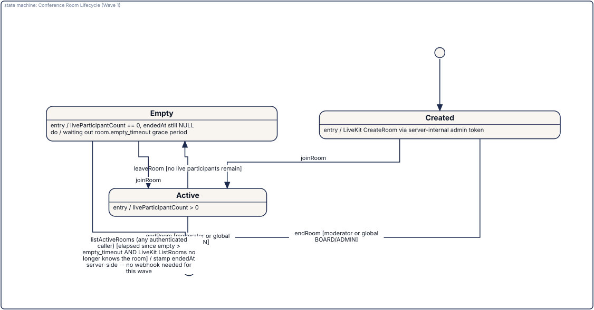

= Lapis Cloud
:description: Federated membership management for associations and parties — with a meritocratic governance layer.
:toc:
:toc-placement: preamble
:icons: font

image::docs/images/lc-banner.png[Lapis Cloud — federated membership management with meritocratic governance,link=https://github.com/lapisproject-dev/Lapis-Cloud]

[.lead]
*Standard membership management, libertarian-extended.* +
Full association and party administration as the foundation, meritocratic governance as the differentiator.

image:https://github.com/lapisproject-dev/Lapis-Cloud/actions/workflows/ci.yml/badge.svg?branch=master[CI,link=https://github.com/lapisproject-dev/Lapis-Cloud/actions/workflows/ci.yml]
image:https://img.shields.io/github/v/tag/lapisproject-dev/Lapis-Cloud?sort=semver&label=version[Version,link=https://github.com/lapisproject-dev/Lapis-Cloud/releases]
image:https://img.shields.io/badge/Kotlin-2.4.10-7F52FF.svg?logo=kotlin&logoColor=white[Kotlin,link=https://kotlinlang.org]
image:https://img.shields.io/github/license/lapisproject-dev/Lapis-Cloud[License,link=https://github.com/lapisproject-dev/Lapis-Cloud/blob/master/LICENSE]
image:https://img.shields.io/github/issues/lapisproject-dev/Lapis-Cloud[Issues,link=https://github.com/lapisproject-dev/Lapis-Cloud/issues]
image:https://img.shields.io/github/issues-pr/lapisproject-dev/Lapis-Cloud[Pull Requests,link=https://github.com/lapisproject-dev/Lapis-Cloud/pulls]
image:https://img.shields.io/github/stars/lapisproject-dev/Lapis-Cloud[Stars,link=https://github.com/lapisproject-dev/Lapis-Cloud/stargazers]
image:https://img.shields.io/github/sponsors/betschwa[Sponsors,link=https://github.com/sponsors/betschwa]

== About Lapis Cloud

Lapis Cloud is the successor to the PZB (PdV Party Central Bank) — a **federated server network**
with a private-law-association character for the membership management of associations and parties.
Every server is sovereign but can federate with other Lapis Cloud instances.

Lapis Cloud covers two orthogonal layers:

. **Standard membership management** — everything a modern association or party administration needs
  (member master data, contribution management, events, communication, GDPR, reporting,
  donation receipts, etc.), at a level that makes parallel specialist tools unnecessary.
. **Innovative libertarian extensions** — meritocratic voting, an internal currency ("Libertaler"),
  internal crowdfunding, pseudonymity with transparency, a right of secession via federation.

The explicit ambition: to become the **de facto standard** for membership management of associations
and parties — completeness over elegance, compliance-first (GDPR, association law, party law, tax law),
usable without prior IT knowledge.

Originally developed for the https://www.parteidervernunft.de[Partei der Vernunft (PdV)], Lapis Cloud
is open source and open to any organization — political parties, traditional associations,
professional bodies, cooperatives, foundations, NGOs.

TIP: Conceptual details, roadmap, and design decisions are maintained in the project vault, not in
this repository. This README describes only the technical scope.

== Related Projects

* https://github.com/lapisproject-dev/Lapis-Net[Lapis Net] — a fully decentralized P2P sister
  project, sharing the same libertarian core principles (meritocratic scoring, self-organization,
  voluntary association) but differing in implementation (P2P nodes instead of federated servers,
  cryptographic trust instead of server federation).
* **PZB** (https://gitlab.com/pdv7/pzb) — the existing predecessor repository. Kept as a **reference**
  (architecture decisions, code patterns) but not adopted 1:1 — Lapis Cloud is
  a clean reimplementation.
* https://kuml.dev[kUML] — the modeling language used for every diagram in this repository
  (see below).

== Technology Stack

* **Language**: https://kotlinlang.org[Kotlin]
* **Server framework**: https://ktor.io[Ktor]
* **Database access**: https://www.jetbrains.com/exposed[Exposed] (Kotlin SQL framework)
* **Database migrations**: https://flywaydb.org[Flyway]
* **Web UI framework**: https://kvision.io[KVision] (Kotlin/JS)
* **Frontend-backend communication**: https://github.com/rjaros/kilua-rpc[Kilua RPC] (type-safe RPC
  between the KVision client and the Ktor server)
* **AI assistance / agentic layer**: https://koog.ai[Koog] (JetBrains, Kotlin-native agent framework,
  multi-LLM without lock-in)

== Status

As of tag `v0.10.0`, eight major waves are complete (see `CHANGELOG.md` for full detail). `v0.9.0`
itself is a hardening/retrofit release, not a new numbered wave: it closes the V0.7.2 ANTRAG
membership-gate audit's disclosed gaps (including the `addCommitteeMember`/`appointElectionBoard`/
`tally` root cause and a related session-revocation gap in `rejectApplication`), a DNS-rebinding
TOCTOU gap in the federation SSRF guard, a GoBD hash-chain timestamp-precision bug, and adds two
retrofits to earlier waves — Änderungsantrag (amendment motion) support for Governance (V0.2.6)
and the V0.6.4 guest/Gast rating-basket closure (Politician Guest Rating, V0.8.5). See
`CHANGELOG.md` `[0.9.0]` for full detail on every item.

* **V0.1 — Project foundation & standard membership management**: Gradle multi-module structure,
  Ktor server, KVision client, Kilua RPC wiring, CI/CD, member master data, join/leave workflow,
  membership tiers, contribution management, document storage, communication (mailing lists,
  direct messages), GDPR basics.
* **V0.2 — Governance foundation**: committee/working-group and meeting management (agenda,
  motions, resolution log), meritocratic voting, democratic elections, and Systemisches
  Konsensieren (systemic consensus-building) as voting modes.
* **V0.3 — Accounting core**: SKR42 chart of accounts with double-entry bookkeeping, GuV/Bilanz/
  Jahresabschluss derivation, the four-sphere Gemeinnützigkeit (non-profit) separation, §55/§62 AO
  Mittelverwendungsrechnung and Rücklagenbildung, a GoBD-informed Kassenbuch, and cost-center
  accounting.
* **V0.4 — Mail-merge & postal mail**: a PDF mail-merge engine (membership dues invoices, §50 EStDV
  donation receipts, invitations) and a Letterxpress-based postal-dispatch path for members without
  email.
* **V0.5 — Compliance bundle**: a §25 PartG donation-acceptance check for political parties, §20
  GwG Transparenzregister board-change reminders with a beneficial-owner data completeness report,
  a hash-chained GoBD audit log, full-organization backup/restore/export, and the DSGVO-Vollausbau
  (AVV register, TOM documentation, DPIA template, data-breach-incident workflow).
* **V0.6 — LTR economy (complete, tag `v0.6.0`)**: a real, ledger-backed LTR balance
  (`LtrLedgerEntry`, replacing the earlier balance stub), Internes Crowdfunding (member-submitted,
  board-reviewed projects with a silence-is-approval clock, Like/Dislike-driven monthly EUR
  donation-pool distribution), an English proxy-bid LTR auction (disabled by default, requires an
  ADMIN to acknowledge a versioned legal-risk disclaimer before enabling — see "Auction opt-in"
  below), direct member-to-member LTR peer transfers (with a board/admin arbitration-correction
  path), Politiker-Profile und Politiker-Ranking (member-only Like/Dislike trust weighting of
  granted politician status, computed as a single shared LTR pool apportioned proportionally across
  all active politicians), and a Price-Oracle for the anchor-asset peg with a load-bearing donation
  → LTR conversion boundary.
* **V0.7 — Authentication, membership & usable UI (complete, tag `v0.7.1`)**: real password login
  and server-side revocable sessions (bcrypt, `HttpOnly`+`Secure`+`SameSite=Strict` cookies),
  replacing the `X-Member-Id` header stand-in every prior version ran on. Self-registration with
  board approval (a real Beitrittsvertrag/Satzungs-acceptance step, never silence-is-approval),
  admin-side direct member creation, a member-initiated exit workflow (`AUSGETRETEN`), and a real
  password-reset token mechanism (email delivery honestly not wired to any real SMTP transport —
  see "What doesn't work yet"). A real multi-screen web UI (login, registration, dashboard, member
  administration, contributions, documents, mailing/direct-messages) replacing the previous
  four-service tech demo, served same-origin from the Ktor server.
* **V0.8 — Federation (complete, tag `v0.8.0`)**: server-to-server content-federation protocol
  Grundgerüst (ActivityPub-hybrid core + a namespaced `lapis:` JSON-LD extension vocabulary for
  Meritokratie-specific data, HTTP-Signature-verified inbox/outbox, no content type wired in yet);
  OIDC-based individual-member guest access (every server is both an OIDC Issuer for its own
  members and a Relying Party for guests from other instances, Authorization Code Flow with PKCE,
  Dynamic Client Registration as the open default — a guest is represented as a real
  `Member(status = GAST)` row, closing the identity-model gap the V0.6.4 note below used to flag);
  Trust-Anchor-Governance (a deliberately single-level OpenID Federation 1.0 subset — explicitly a
  UX-comfort layer, never a security gate for federation/guest-login/DCR); and a navbar guest badge
  (violet indicator + hover/focus/tap popover disclosing the guest's home server, WCAG-AA
  contrast-verified, screen-reader accessible). Content/Timeline-level guest marking is not built —
  this codebase has no "Timeline"/"Post" content entity yet, see "What doesn't work yet".

**`v0.10.0`** is a UI-only release, closing the two highest-priority items a V1.0-readiness review
found with this project's two real pilot organizations: 13 backend domains had zero client UI,
reachable only via Kilua RPC / raw HTTP — a treasurer or board member without developer access
could not use any of them. The pilots picked Governance and Accounting as the two highest-priority
gaps to close first. Both are done: a **Governance UI** (committees/working-group membership,
meeting management with a live-recalculated quorum display and a printable protocol/Beschlussbuch
draft, and the full motion/amendment/voting workflow) and an **Accounting UI** (the SKR42 chart of
accounts and journal with a draft-then-post workflow, GuV/Bilanz/Jahresabschluss, the four-sphere
Gemeinnützigkeit report and the §55/§62 AO Mittelverwendungsrechnung, cost centers, and external
donors/§50 EStDV donation-duty reporting) — both real KVision screens over the already-tested RPC
backends, both went through this project's mandatory UI/UX-Design-Team review before
implementation. See `CHANGELOG.md` `[0.10.0]` for full detail on both waves.

Every wave went through this project's mandatory plan → implement → independent review →
independent security audit pipeline before merging — the V0.8 waves additionally went through a
dedicated adversarial live-attack phase each, given the project's own "most security-critical
version in the backlog" classification for federation work; V0.8.1's pass found and fixed a real
IPv6 Unique-Local-Address SSRF gap live. Known limitations (Letterxpress wire format and the
oracle's price-source wire formats not verified against live docs, no Sammelbestätigung
aggregation, no full GoBD tamper-evidence/TSE, no persistent oracle halt-queue, no guest/Gast
participation in the LTR economy yet) are tracked in `CHANGELOG.md`. The DNS-rebinding TOCTOU gap
in the federation SSRF guard, disclosed in this list until `v0.9.0`, is now closed — see
`CHANGELOG.md` `[0.9.0]`. See link:docs/architecture/domain-model.adoc[domain model
documentation] (covers the V0.1.5 Contributions/Documents/Communication slice, the V0.3 accounting
slices, the V0.4.1 mail-merge slice, and the V0.6.5 Price-Oracle slice — not updated for every wave
since) and `CLAUDE.md` for further detail.

NOTE: The V0.6.4 guest/Gast rating basket cut (`PoliticianProfileDto` exposed `memberTrustWeight`
only, not the concept's three-way Mitglieder-/Gäste-/Gesamtbewertung) was accepted scope
(product-owner sign-off 2026-07-22) for as long as no operational Gast identity model existed in
this codebase. **Closed**: once V0.8.2 gave every guest a real `Member(status = GAST)` row, the
guest/combined rating basket was implemented (`guestTrustWeight`/`combinedTrustWeight`, a
deliberately unweighted vote-count mechanic for the guest side — see `CHANGELOG.md` for why an
LTR-weighted guest pool isn't possible yet, since no guest LTR-earning mechanism exists). No
client UI for Politician Profiles exists yet (backend/RPC-only, unchanged from V0.6.4). See
`CHANGELOG.md` `[0.6.0]` for the original scope-cut reasoning and `[0.9.0]` for the closure.

=== Auction opt-in (V0.6.2)

The legal classification of an LTR-for-goods marketplace (payment-services supervision, trade law,
tax law, consumer protection, party-donation law, anti-money-laundering law) depends on
jurisdiction and organization type — no single blanket legal review can resolve this for every
future Lapis Cloud deployment. The auction ships **disabled by default**
(`OrganizationSettings.auctionEnabled = false`); an ADMIN must call `enableAuction` with the
SHA-256 hash of the currently displayed, versioned legal-risk disclaimer before it activates.
Enabling it is an operational decision for each organization's own operator, informed by their own
legal counsel — not something this project can decide once for everyone. See `CHANGELOG.md`
`[0.6.0]` and the disclaimer text in `AuctionComplianceDisclaimer.kt` for detail.

=== What doesn't work yet

* **Real email delivery exists (V1.2.3) but is optional and off by default.** Password-reset
  tokens are real (hash-only-persisted, single-use, short-TTL); `SmtpPasswordResetMailer` sends a
  real message via Jakarta Mail/Eclipse Angus whenever `LAPIS_SMTP_*` is configured
  (`deploy/production/README.adoc` "E-Mail-Versand (SMTP, optional)"), and falls back to the same
  honestly-disclosed `NoOpMailTransport` log-only stub `MailingService.sendMailingMessage` has had
  since V0.4/V0.1.5 when it is not. `MailingService.sendMailingMessage`'s own bulk-mailing simulation
  is unaffected — this wave only wires up the two single-recipient transactional mailers.
* **FRIEND email verification now has a working delivery path AND a client landing screen (V1.2.3),
  but enforcement is still off.** `MemberStatus.FRIEND` (V0.11.0) is a self-registerable status
  (`/register-friend`, no board approval, no identity check) scoped strictly to video-conference
  access on a per-room opt-in basis — it is not membership in the organization, carries no
  Beitragspflicht/governance/accounting/LTR rights, and no `PUBLIC_MEMBERS` document access. The
  `friend_email_verification_token` mechanics, the real mail (`SmtpFriendVerificationMailer`), and
  the `#/verify-email?token=...` client deep link (`renderVerifyEmailScreen`) all exist end to end
  now; `LAPIS_FRIEND_REQUIRE_EMAIL_VERIFICATION` (default `false`) stays off regardless — activating
  hard enforcement is a separate, later operational decision, not something this wave flips
  automatically.
* **UI coverage beyond Governance and Accounting.** Compliance (Transparenzregister, §25 PartG,
  audit log, backup/restore, DSGVO), mail-merge/postal dispatch, and the LTR economy (Crowdfunding,
  Auction, Peer-Transfer, Politician Profiles) still have no UI — reachable only via Kilua RPC / the
  HTTP routes. Governance and Accounting closed the same gap for their domains, see above; the
  remaining domains are lower day-to-day usage frequency per the pilots' own prioritization and are
  not yet scheduled as numbered waves.
* **No content type is actually federated yet.** V0.8.1 built the ActivityPub-hybrid protocol
  layer; no existing content type (crowdfunding projects, politician profiles, governance
  resolutions) is wired into outbound federation. A future wave's own explicit product decision.
* **No guest participation in the LTR economy.** A federated guest (V0.8.2) is authenticated and
  represented, but not wired into LTR staking/posting/earning — that mechanics is deliberately not
  built yet, a separate scope decision from identity itself.

None of this is a secret gap. See the project vault's Lapis Cloud roadmap for the up-to-date wave
plan.

== Videokonferenzen (V1.0 Wave 1)

A self-hosted video-conferencing module for small meetings (the concept note's "Kleinsitzung" use
case, first application: Vorstandssitzungen) — own infrastructure on
https://livekit.io[LiveKit] rather than an embedded third-party widget or a BigBlueButton
integration, matching this project's "own stack, own data" posture everywhere else. `IConferenceService`
covers room creation/join/leave/end, a live participant roster, and moderator actions
(remove a participant, end the room for everyone); the KVision client (`ConferenceScreen.kt`) adds a
responsive video-tile grid, a persistent control bar (microphone/camera/screen-share/chat/leave), and
a collapsible ephemeral chat panel riding LiveKit's own data channel. Two-tier roles only in this
wave: MODERATOR (the room's creator) and PARTICIPANT (everyone else), with a global BOARD/ADMIN
escalation on the two moderator-only actions — see `IConferenceService` KDoc for the full
per-method authorization table.

Local development/testing infrastructure (`deploy/local/` — this repository's first Docker setup) and
a full local-run recipe, including a two-browser manual verification walkthrough and an opt-in live
integration test, are documented in link:deploy/local/README.adoc[deploy/local/README.adoc].

NOTE: GitHub's built-in `.adoc` viewer does not load the `kuml-asciidoc` extension, so it cannot
execute the `[kuml]` macro below and shows its raw source instead. The image immediately below is a
pre-rendered copy of that exact model, committed purely so GitHub's preview has something to show
— the `[kuml]` block underneath stays the single source of truth (see "Documentation Convention"
below) and is what actually renders in Antora/local Asciidoctor builds. **If you edit the model,
re-render `docs/images/conference-room-lifecycle.svg` from it** (`kuml render <extracted-source>
--format svg`) — nothing enforces that these two stay in sync automatically.

[kuml, conference-room-lifecycle, svg]
----
import dev.kuml.sysml2.dsl.sysml2Model

sysml2Model(name = "ConferenceRoomLifecycle") {

    val initial = stateDef(name = "Initial", isInitial = true)
    val created = stateDef(
        name = "Created",
        entryAction = "LiveKit CreateRoom via server-internal admin token",
    )
    val active = stateDef(
        name = "Active",
        entryAction = "liveParticipantCount > 0",
    )
    val empty = stateDef(
        name = "Empty",
        entryAction = "liveParticipantCount == 0, endedAt still NULL",
        doAction = "waiting out room.empty_timeout grace period",
    )
    val ended = stateDef(name = "Ended", isFinal = true, entryAction = "endedAt stamped")

    transition(name = "init", source = initial, target = created)
    transition(name = "firstJoin", source = created, target = active, trigger = "joinRoom")
    transition(
        name = "moderatorEndsCreated", source = created, target = ended,
        trigger = "endRoom", guard = "moderator or global BOARD/ADMIN",
    )
    transition(
        name = "moderatorEndsActive", source = active, target = ended,
        trigger = "endRoom", guard = "moderator or global BOARD/ADMIN",
    )
    transition(
        name = "lastLeaves", source = active, target = empty,
        trigger = "leaveRoom", guard = "no live participants remain",
    )
    transition(name = "rejoin", source = empty, target = active, trigger = "joinRoom")
    transition(
        name = "moderatorEndsEmpty", source = empty, target = ended,
        trigger = "endRoom", guard = "moderator or global BOARD/ADMIN",
    )
    transition(
        name = "lazyReconcile", source = empty, target = ended,
        trigger = "listActiveRooms (any authenticated caller)",
        guard = "elapsed since empty > empty_timeout AND LiveKit ListRooms no longer knows the room",
        effect = "stamp endedAt server-side -- no webhook needed for this wave",
    )

    stmDiagram(name = "Conference Room Lifecycle (Wave 1)") {
        include(state = initial)
        include(state = created)
        include(state = active)
        include(state = empty)
        include(state = ended)
    }
}
----

The `Empty -> Ended` "lazy reconcile" transition is deliberate: this wave has no LiveKit webhook
consumer (every client-visible need is already covered by the LiveKit SDK's own `RoomEvent` stream,
and `endRoom` is a synchronous call), so a room whose participants all simply left — rather than
having the moderator explicitly end it — only gets `endedAt` stamped the next time *any* authenticated
member calls `listActiveRooms` and that reconciliation notices LiveKit no longer lists the room past
its empty-timeout grace. Exact, event-accurate presence timestamps (and, downstream of that, a
"Teilnehmerliste = Anwesenheitsliste" attendance integration) are deliberately deferred to a future
wave that does add webhooks.

**Explicitly out of scope for Wave 1** (see the wave's own KDoc/design-review notes for the full
list): recording/streaming (LiveKit Egress, RTMP), whiteboard/document sharing, breakout rooms,
live subtitles/translation, hand-raise/reactions, a lobby/Warteraum, the full four-tier
Moderator/Präsentator/Teilnehmer/Zuhörer role model, E2EE, "Termin → Konferenzraum" integration with
the Sitzungen/Gremien module, voting-module integration, federated guest join, and chat persistence
(chat is intentionally ephemeral — it travels only over the LiveKit data channel and is never
written to the database, so it carries no GoBD/DSGVO retention obligation). The Wave 1 design
review additionally flagged D1 (single-button room creation instead of today's title-entry form),
D2 (a first-class, non-technical camera/microphone permission preflight screen), D3 (a
speaking-priority reflow above ~12 participants) and D10 (a fully named client-side connection
state machine) as still-open polish items for the next Videokonferenzen step — not yet built, see
`ConferenceScreen.kt`'s own file KDoc.

== Payment service provider (Stripe)

Welle V1.2.8 (GitHub Issue #6) lets members pay contributions and leave donations through a
Stripe-hosted Checkout (card only, EUR). **Scoped to Stripe only** this wave — PayPal stays a valid
`PaymentProvider` literal but `enablePaymentGateway(PAYPAL, ...)` is rejected; see
`IPaymentGatewayService` KDoc for the reasoning (Stripe's webhook signature is a self-contained,
dependency-free HMAC; PayPal's own verification needs either a live outbound call inside the
webhook path or manual certificate-chain validation).

=== Three independent gates

MINOR fix (code review, Welle V1.2.8) — this list previously named the ledger-account mapping as a
third checked gate; it is not one of `requirePaymentGatewayUsable()`'s checks (see
`IPaymentGatewayService` KDoc, "The three-part usability gate", the authoritative source this list
now mirrors). Payment acceptance is only possible when **all three** hold — checked both at
checkout creation and again when the webhook arrives, so a gate flipped off mid-flight stops the
posting:

1. **`organization_settings.payment_gateway_enabled`** — an ADMIN acknowledges a versioned
   legal-risk disclaimer (`PaymentGatewayComplianceDisclaimer`) via `enablePaymentGateway`/
   `disablePaymentGateway`, same auditable acknowledgment mechanism as the auction opt-in above.
2. **The CURRENT disclaimer version was acknowledged** — same "stale acknowledgment blocks writes"
   posture `SepaService.requireSepaUsable` already establishes for SEPA; a newly published
   disclaimer version blocks writes again until re-acknowledged.
3. **Deployment secrets present AND `STRIPE` configured** —
   `LAPIS_STRIPE_SECRET_KEY`/`LAPIS_STRIPE_WEBHOOK_SIGNING_SECRET` both set and well-formed
   (`PspConfigState.Configured`), AND `organization_settings.payment_gateway_provider` is `STRIPE`
   (`PAYPAL` is a valid literal but rejected by `enablePaymentGateway`, see above).

A **complete ledger-account mapping** (`paymentBankAccountId`/`contributionIncomeAccountId`/
`donationIncomeAccountId`/`paymentFeeAccountId`, the fee account only mattering once a provider fee
is ever captured, which this wave does not do) is configured via the ordinary
`updateOrganizationSettings` RPC, but is **not** one of the three gates above — an incomplete
mapping instead degrades a webhook-confirmed payment to an `UNPOSTED` row in the treasurer's
`Zahlungseingänge` reconciliation queue rather than losing it silently, and rather than blocking
checkout creation up front.

=== Environment variables — secrets are ENV-ONLY, never persisted

Same discipline as `LAPIS_SMTP_*` above: `PspConfig.load()` is the ONLY place any of these are read,
never persisted to the database, never `SecretBox`-sealed (that mechanism is reserved for
credentials that live in a database row — a Stripe API key is a single org-wide deployment
credential, not per-row data). All-or-nothing: either both `LAPIS_STRIPE_SECRET_KEY`/
`LAPIS_STRIPE_WEBHOOK_SIGNING_SECRET` are set, or neither — a half configuration fails the server's
startup with an explicit `IllegalStateException` naming the missing/invalid variable by NAME ONLY,
never its value. See `deploy/production/.env.example`/`deploy/production-elb/.env.example` for the
full block including the optional numeric overrides (webhook timestamp tolerance, per-donation
maximum, checkout-session TTL).

There is **no RPC that writes these secrets** — `getPspConfigStatus()` (ADMIN-only) reports only
whether each is present as a boolean, never a prefix/suffix/length/value.

=== Stripe dashboard webhook configuration

Register this URL in the Stripe dashboard for the `checkout.session.completed` event (and
optionally `checkout.session.expired`):

----
<LAPIS_PUBLIC_BASE_URL>/api/webhooks/stripe
----

Copy the signing secret Stripe displays there (`whsec_...`) into `LAPIS_STRIPE_WEBHOOK_SIGNING_SECRET`.

=== What doesn't work yet (this wave)

Deliberately out of scope, see `CHANGELOG.md` for the full list: PayPal, refunds/chargebacks,
capturing the PSP's own transaction fee (the full gross amount posts to the bank/income accounts),
recurring/subscription billing, currencies other than EUR, and anonymous (non-member) donations.

== Public REST API (V1.3.1)

A read-only REST API under `/api/v1` — `/members`, `/committees`, `/meetings`, `/meetings/{id}`,
`/resolutions`, `/motions` — for external, machine-to-machine consumption, independent of the
Kilua-RPC layer `lapis-client` uses. Authenticated via `Authorization: Bearer lapis_<key>`, a
credential namespace kept structurally separate from session cookies/tokens. Board/Admin members
issue and manage keys under *Verwaltung → API-Schlüssel*. Full endpoint/field/rate-limit reference:
`docs/api/public-api-v1.adoc`.

=== What doesn't work yet (this wave)

Deliberately out of scope, see `CHANGELOG.md`: any write endpoint, webhooks, OAuth2/OIDC/scopes,
multi-tenancy, distributed rate limiting, OpenAPI/Swagger, ETag/caching, CORS, field
selection/sorting/full-text search/cursor pagination, bulk endpoints, automatic key rotation/expiry
mail/cleanup.

== Documentation Convention

Consistent across all Lapis and kUML projects (see `CLAUDE.md`):

* **All documentation in Asciidoctor** (`.adoc`) — no `README.md`
* **All diagrams in kUML**, no PlantUML/Mermaid/draw.io/ASCII art
* **Diagrams embedded via the `[kuml]` macro** of the https://github.com/kuml-dev/kuml-asciidoc[kuml-asciidoc]
  extension (Maven Central) — source inline in the `.adoc` document is the single source of truth,
  never *replaced* by a pre-rendered image. **Exception**: GitHub's built-in `.adoc` viewer does not
  load the extension, so it cannot execute `[kuml]` blocks — for diagrams meant to be visible there
  (like this README's own), commit a companion `image::docs/images/<name>.svg[...]` reference
  immediately above the `[kuml]` block, purely as a GitHub-preview fallback, and re-render it by
  hand whenever the model changes (see the note above the first diagram below for the exact
  command). Nothing enforces that the two stay in sync — this is a deliberate, manual trade-off, not
  an automated build step.

[source,asciidoc]
----
[kuml, filename-without-extension, svg]
----
<kUML source>
----
----

== Branch and Development Workflow

* The default branch is always **`master`**, never `main`
* Feature branches stay **local** and are never pushed
* Releases happen via a local squash-merge onto `master`, then push
* Never `--force` push without an explicit instruction

Details: `CLAUDE.md` in this repository.

== License

Apache License 2.0 — see `LICENSE`.
