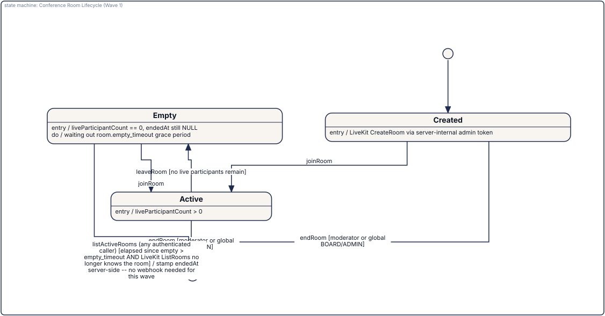

= Videokonferenzen (V1.0 Wave 1)
:toc:

A self-hosted video-conferencing module for small meetings (the concept note's "Kleinsitzung" use
case, first application: Vorstandssitzungen) — own infrastructure on
https://livekit.io[LiveKit] rather than an embedded third-party widget or a BigBlueButton
integration, matching this project's "own stack, own data" posture everywhere else. `IConferenceService`
covers room creation/join/leave/end, a live participant roster, and moderator actions
(remove a participant, end the room for everyone); the KVision client (`ConferenceScreen.kt`) adds a
responsive video-tile grid, a persistent control bar (microphone/camera/screen-share/chat/leave), and
a collapsible ephemeral chat panel riding LiveKit's own data channel. Since V1.4.23 the call also offers background blur and six built-in background images, processed
locally in the browser (no image is sent to the server; the segmentation WASM and model are served from this
server, never from a CDN). On a browser or device without the required support -- and, deliberately, inside the
mobile app's embedded WebView, where the combination has never been measured -- the row stays visible but disabled
with an explanation -- see link:../architecture/video-background-effects.adoc[video-background-effects.adoc]. Two-tier roles only in this
wave: MODERATOR (the room's creator) and PARTICIPANT (everyone else), with a global BOARD/ADMIN
escalation on the two moderator-only actions — see `IConferenceService` KDoc for the full
per-method authorization table.

Local development/testing infrastructure (`deploy/local/` — this repository's first Docker setup) and
a full local-run recipe, including a two-browser manual verification walkthrough and an opt-in live
integration test, are documented in link:../../deploy/local/README.adoc[deploy/local/README.adoc].

== Database session timeouts (V1.9.55)

The application pool applies three PostgreSQL session timeouts to every connection (integer milliseconds, `0` = off, an invalid value stops
the start). `deploy/example/docker-compose.yml` forwards them with the defaults below.

[cols="2,1,3", options="header"]
|===
| Variable | Default | Meaning
| `LAPIS_DB_LOCK_TIMEOUT_MS` | 10000 | Maximum wait for a row or index lock.
| `LAPIS_DB_STATEMENT_TIMEOUT_MS` | 60000 | Maximum run time of one statement (must be greater than the lock timeout unless one of them is 0).
| `LAPIS_DB_IDLE_TX_TIMEOUT_MS` | 120000 | Maximum idle time inside an open transaction.
|===

Exposed re-runs a failed transaction up to three times, so one request can wait up to three lock timeouts. A timeout reaches the user as
"The server is currently busy" and never shows database text. No migration. Details, relaxations (export, full-text index) and the
idempotency table: link:../architecture/database-timeouts-and-retries.adoc[database-timeouts-and-retries.adoc].

== Postgres test lane (V1.9.37)

The normal test suite runs on H2. A second Gradle task, `./gradlew :lapis-server:postgresTest`, runs the engine-dependent specs (Flyway
chain, schema equivalence with H2, row locks, isolation, deadlocks, concurrency) against a real, disposable PostgreSQL; it is part of `check`
and is skipped when `LAPIS_TEST_POSTGRES_URL` is not set. CI runs it in its own job (V1.9.58) against a `postgres:17` service container, and fails that job when the lane was skipped. Start it locally with a
fresh Docker container bound to `127.0.0.1` -- see link:../architecture/postgres-test-lane.adoc[postgres-test-lane.adoc]. Never set
`LAPIS_DB_URL` for it and never point it at a real database (the lane refuses).

NOTE: GitHub's built-in `.adoc` viewer does not load the `kuml-asciidoc` extension, so it cannot
execute the `[kuml]` macro below and shows its raw source instead. The image immediately below is a
pre-rendered copy of that exact model, committed purely so GitHub's preview has something to show
— the `[kuml]` block underneath stays the single source of truth (see "Documentation Convention"
below) and is what actually renders in Antora/local Asciidoctor builds. **If you edit the model,
re-render `docs/images/conference-room-lifecycle.svg` from it** (`kuml render <extracted-source>
--format svg`) — nothing enforces that these two stay in sync automatically.

[kuml, conference-room-lifecycle, svg]
----
import dev.kuml.sysml2.dsl.sysml2Model

sysml2Model(name = "ConferenceRoomLifecycle") {

    val initial = stateDef(name = "Initial", isInitial = true)
    val created = stateDef(
        name = "Created",
        entryAction = "LiveKit CreateRoom via server-internal admin token",
    )
    val active = stateDef(
        name = "Active",
        entryAction = "liveParticipantCount > 0",
    )
    val empty = stateDef(
        name = "Empty",
        entryAction = "liveParticipantCount == 0, endedAt still NULL",
        doAction = "waiting out room.empty_timeout grace period",
    )
    val ended = stateDef(name = "Ended", isFinal = true, entryAction = "endedAt stamped")

    transition(name = "init", source = initial, target = created)
    transition(name = "firstJoin", source = created, target = active, trigger = "joinRoom")
    transition(
        name = "moderatorEndsCreated", source = created, target = ended,
        trigger = "endRoom", guard = "moderator or global BOARD/ADMIN",
    )
    transition(
        name = "moderatorEndsActive", source = active, target = ended,
        trigger = "endRoom", guard = "moderator or global BOARD/ADMIN",
    )
    transition(
        name = "lastLeaves", source = active, target = empty,
        trigger = "leaveRoom", guard = "no live participants remain",
    )
    transition(name = "rejoin", source = empty, target = active, trigger = "joinRoom")
    transition(
        name = "moderatorEndsEmpty", source = empty, target = ended,
        trigger = "endRoom", guard = "moderator or global BOARD/ADMIN",
    )
    transition(
        name = "lazyReconcile", source = empty, target = ended,
        trigger = "listActiveRooms (any authenticated caller)",
        guard = "elapsed since empty > empty_timeout AND LiveKit ListRooms no longer knows the room",
        effect = "stamp endedAt server-side -- no webhook needed for this wave",
    )

    stmDiagram(name = "Conference Room Lifecycle (Wave 1)") {
        include(state = initial)
        include(state = created)
        include(state = active)
        include(state = empty)
        include(state = ended)
    }
}
----

The `Empty -> Ended` "lazy reconcile" transition is deliberate: this wave has no LiveKit webhook
consumer (every client-visible need is already covered by the LiveKit SDK's own `RoomEvent` stream,
and `endRoom` is a synchronous call), so a room whose participants all simply left — rather than
having the moderator explicitly end it — only gets `endedAt` stamped the next time *any* authenticated
member calls `listActiveRooms` and that reconciliation notices LiveKit no longer lists the room past
its empty-timeout grace. Exact, event-accurate presence timestamps (and, downstream of that, a
"Teilnehmerliste = Anwesenheitsliste" attendance integration) are deliberately deferred to a future
wave that does add webhooks.

**Explicitly out of scope for Wave 1** (see the wave's own KDoc/design-review notes for the full
list): recording/streaming (LiveKit Egress, RTMP), whiteboard/document sharing, breakout rooms,
live subtitles/translation, hand-raise/reactions, a lobby/Warteraum, the full four-tier
Moderator/Präsentator/Teilnehmer/Zuhörer role model, E2EE, "Termin → Konferenzraum" integration with
the Sitzungen/Gremien module, voting-module integration, federated guest join, and chat persistence
(chat is intentionally ephemeral — it travels only over the LiveKit data channel and is never
written to the database, so it carries no GoBD/DSGVO retention obligation). The Wave 1 design
review additionally flagged D1 (single-button room creation instead of today's title-entry form),
D2 (a first-class, non-technical camera/microphone permission preflight screen), D3 (a
speaking-priority reflow above ~12 participants) and D10 (a fully named client-side connection
state machine) as still-open polish items for the next Videokonferenzen step — not yet built, see
`ConferenceScreen.kt`'s own file KDoc.

== A conference across navigation (V1.9.69-V1.9.71, released in v0.31.1)

Client only, no server change; listed under `[Unreleased]` in `CHANGELOG.md`. **Navigating no longer ends the call** (V1.9.70): the call
view is kept in a conference dock and only hidden, so microphone, camera, remote audio, chat, roster, running votes and a secret-ballot
receipt keep running. While the call view is not on screen, a mini bar at the bottom of the page stands for it (status, recording /
live-stream badges, "Abstimmung läuft", microphone, camera, stop sharing, "Verlassen", "Zur Konferenz"); from 768 px a small,
non-modal **floating window** (V1.9.71) does so by default, with a big picture, up to three more pictures, the same controls, three sizes,
drag and resize plus a full keyboard alternative; "Einklappen" turns it back into the bar, and its position and size are remembered on
the device. A phone only gets the bar. There is one conference per browser tab. The call still ends with "Verlassen", "Für alle
beenden", a kick, the end of the meeting, sign-out, an account switch, a language switch, and a reload or closing the tab.
**One account, one device** (V1.9.69): a second sign-in with the same account evicts the first connection, which now shows "Auf einem
anderen Gerät verbunden" with "Hier fortsetzen" / "Zur Übersicht" instead of re-joining by itself (automatic re-joins are bounded to
3 per 60 s); multi-device support is planned, not built. The encounter room is not part of the dock (leaving its page still ends it).
**Not verified**: no test with a real call, real participants, two real devices, Safari/iOS or a real phone; no picture-in-picture and no
chat in the floating window; the new texts are agent translations not checked by native speakers. See
link:../architecture/conference-dock.adoc[conference-dock.adoc].
